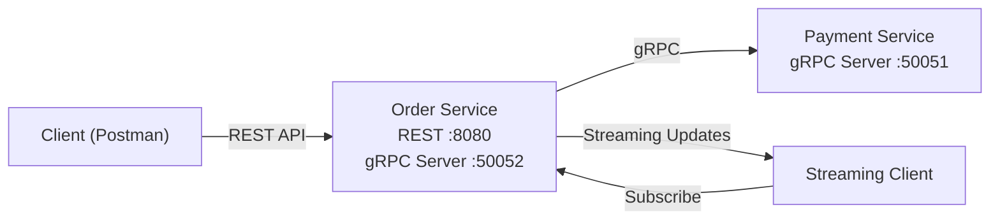

# AP2 Assignment 2 - gRPC Migration

## Overview

This project demonstrates migration from REST to gRPC communication between microservices.

The system consists of:

* Order Service (REST + gRPC server for streaming)
* Payment Service (gRPC server)

---

## Technologies

* Go
* gRPC
* Protocol Buffers
* PostgreSQL
* Gin (REST)

---

## Architecture

* External communication: REST (Order Service)
* Internal communication: gRPC (Order → Payment)
* Streaming: Order Service → Client (real-time updates)

---

## gRPC Services

### Payment Service

* `ProcessPayment(PaymentRequest) → PaymentResponse`

### Order Service

* `SubscribeToOrderUpdates(OrderRequest) → stream OrderStatusUpdate`

---

## How to Run

### 1. Start Payment Service

```bash
cd payment-service
go run cmd/main.go
```

### 2. Start Order Service

```bash
cd order-service
go run cmd/main.go
```

---

## Environment Variables

```env
GRPC_PAYMENT_ADDR=localhost:50051
```

---

## Testing

### Create Order

```http
POST /orders
```

### Cancel Order

```http
PATCH /orders/{id}/cancel
```

### Streaming

Run streaming client and observe:

```
STATUS: Pending
STATUS: Cancelled
```

---

## Features

* Contract-first development using Protocol Buffers
* gRPC client/server implementation
* Server-side streaming with real-time DB updates
* Clean Architecture preserved

---

## Evidence

* Order creation (Paid)
* gRPC communication
* Streaming updates (Pending → Cancelled)

---

## Conclusion

The system was successfully migrated from REST to gRPC, improving type safety and enabling real-time communication via streaming.


## 📊 Architecture Diagram



