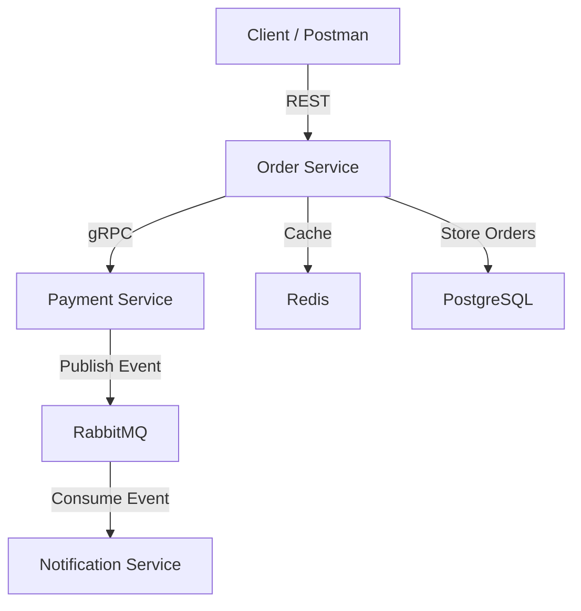
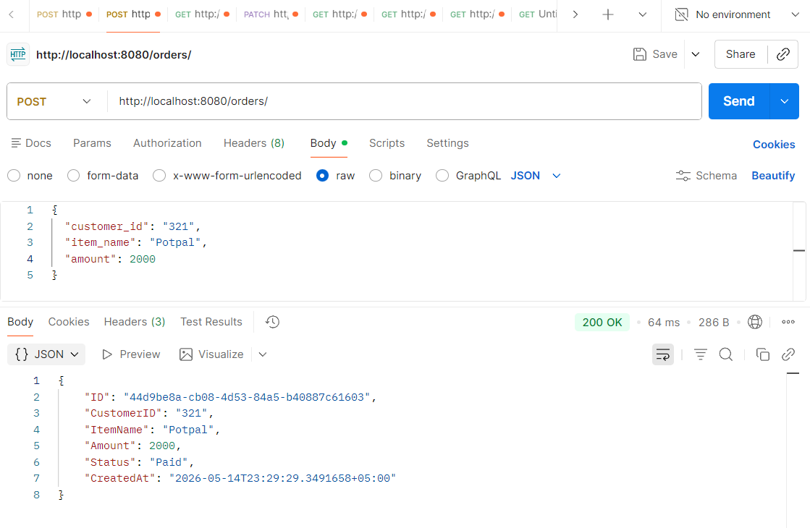
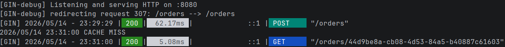
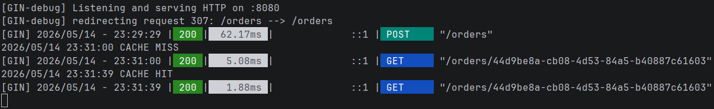
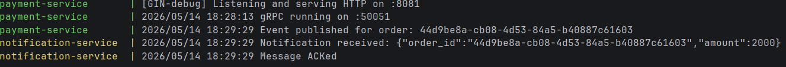

# Assignment 4 - Distributed Caching and Event-Driven Microservices

## Overview

This project demonstrates a distributed microservice architecture using:

* REST API
* gRPC communication
* RabbitMQ event-driven messaging
* Redis distributed caching
* Docker Compose orchestration
* PostgreSQL persistence

The system consists of three microservices:

* Order Service
* Payment Service
* Notification Service

The project implements asynchronous communication, distributed caching, and microservice interaction patterns.

---

# Architecture Diagram



---

# Technologies Used

* Go
* Gin
* gRPC
* RabbitMQ
* Redis
* PostgreSQL
* Docker
* Docker Compose
* GitHub Actions

---

# Microservices

## Order Service

Responsibilities:

* Create orders
* Get order information
* Cancel orders
* Communicate with Payment Service using gRPC
* Cache orders in Redis

REST Endpoints:

```http
POST /orders
GET /orders/:id
PATCH /orders/:id/cancel
GET /orders/stats
```

---

## Payment Service

Responsibilities:

* Process payments
* Publish payment events to RabbitMQ
* Provide gRPC API

Business rule:

```text
Amount > 100000 → Declined
Otherwise → Authorized
```

---

## Notification Service

Responsibilities:

* Consume RabbitMQ events
* Simulate notification delivery
* Handle duplicate messages safely
* Use manual ACK processing

---

# Event-Driven Architecture

Flow:

1. Client sends REST request to Order Service.
2. Order Service calls Payment Service using gRPC.
3. Payment Service processes payment.
4. Payment Service publishes event to RabbitMQ.
5. Notification Service consumes event asynchronously.
6. Notification Service manually acknowledges message.

---

# Redis Distributed Caching

This assignment implements Redis distributed caching using the Cache-Aside pattern.

## Cache-Aside Flow

```text
GET Order
    ↓
Check Redis Cache
    ↓
CACHE HIT  → return cached data
CACHE MISS → fetch from PostgreSQL
           → save to Redis
           → return response
```

---

# Cache Invalidation

When an order is updated or cancelled:

```text
Update Order
    ↓
Delete Redis Cache
    ↓
Next request reloads fresh data
```

This prevents stale cached data.

---

# RabbitMQ Features

Implemented RabbitMQ reliability features:

* Durable queues
* Manual ACK
* Asynchronous communication
* Producer / Consumer pattern
* Idempotent consumer logic

Queue name:

```text
payment.completed
```

---

# Manual ACK

Messages are acknowledged only after successful processing.

Example:

```go
msg.Ack(false)
```

This guarantees reliable delivery.

---

# Idempotency

Notification Service prevents duplicate message processing.

Duplicate events are skipped safely.

Example logs:

```text
Duplicate message skipped
```

---

# Docker Compose

Infrastructure services are containerized using Docker Compose.

Containers:

* rabbitmq
* redis
* payment-service
* notification-service

Run:

```bash
docker compose up --build
```

---

# RabbitMQ Dashboard

RabbitMQ Management UI:

```text
http://localhost:15672
```

Credentials:

```text
username: guest
password: guest
```

---

# Redis Cache Demonstration

First request:

```text
CACHE MISS
```

Second request:

```text
CACHE HIT
```

This demonstrates Redis caching optimization.

---

# Example API Request

## Create Order

```http
POST http://localhost:8080/orders
```

Request body:

```json
{
  "customer_id": "321",
  "item_name": "Laptop",
  "amount": 2000
}
```

Response:

```json
{
  "status": "Paid"
}
```

---

# Screenshots

## Create Order



---

## Cache MISS



---

## Cache HIT



---

## RabbitMQ Events



---

## RabbitMQ Dashboard


---

## Docker Compose


---

# Result

This project successfully demonstrates:

* REST microservices
* gRPC communication
* gRPC streaming
* RabbitMQ event-driven architecture
* Redis distributed caching
* Cache-aside pattern
* Cache invalidation
* Dockerized infrastructure
* PostgreSQL persistence
* Manual ACK handling
* Idempotent consumers
* Asynchronous messaging
* Producer / Consumer architecture
* CI/CD with GitHub Actions

