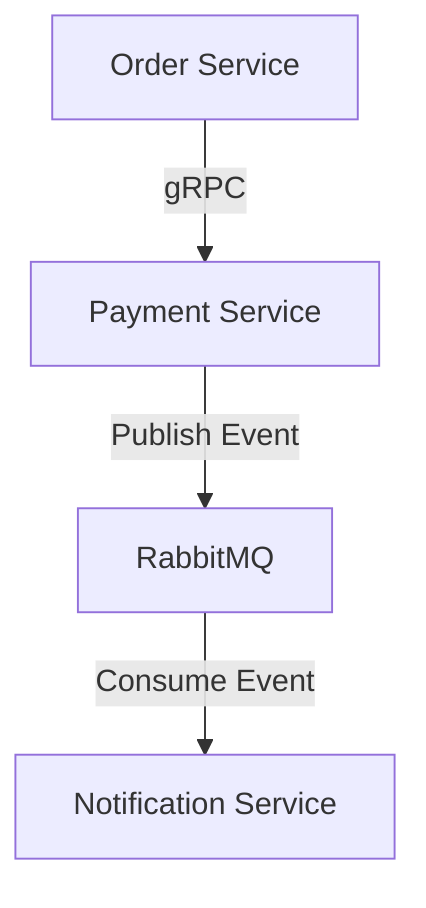

# Assignment 3 - Event-Driven Architecture with RabbitMQ

## Overview

This project demonstrates Event-Driven Architecture (EDA) using RabbitMQ.

The system consists of three microservices:

- Order Service
- Payment Service
- Notification Service

The Payment Service publishes events to RabbitMQ after successful payment processing, while the Notification Service consumes these events asynchronously.

This implementation includes:
- gRPC communication
- RabbitMQ message broker
- Manual ACKs
- Durable queues
- Idempotent consumer
- Docker Compose orchestration

---

## Architecture Diagram



---

## Event Flow

1. Order Service sends a gRPC request to Payment Service.
2. Payment Service processes payment.
3. After successful processing, Payment Service publishes an event to RabbitMQ.
4. Notification Service consumes the event asynchronously.
5. Consumer manually acknowledges the message after successful processing.

---

## Technologies

- Go
- gRPC
- RabbitMQ
- Docker
- Docker Compose
- Gin
- PostgreSQL

---

## Services

### Order Service

Responsibilities:
- Create orders
- Communicate with Payment Service using gRPC

---

### Payment Service (Producer)

Responsibilities:
- Process payments
- Publish payment events to RabbitMQ

Published event payload:

```json
{
  "order_id": "111",
  "amount": 100,
  "status": "Authorized"
}
```

Queue name:

```text
payment.completed
```

---

### Notification Service (Consumer)

Responsibilities:
- Consume RabbitMQ messages
- Simulate sending notifications
- Handle duplicate messages safely

Example logs:

```text
Notification received: {"order_id":"111","amount":100}
Message ACKed
Duplicate message skipped: {"order_id":"111","amount":100}
```

---

## Reliability Implementation

### Manual ACK

Auto-ACK is disabled.

Messages are acknowledged only after successful processing.

Example:

```go
msg.Ack(false)
```

This ensures at-least-once delivery.

---

### Durable Queue

RabbitMQ durable queues are enabled to ensure messages survive broker restart.

Example:

```go
QueueDeclare(
    "payment.completed",
    true,
    false,
    false,
    false,
    nil,
)
```

---

## Idempotency Strategy

The Notification Service implements idempotent message handling.

Processed messages are stored in-memory using a map to prevent duplicate processing.

If the same message is delivered twice, it is skipped.

Example:

```text
Duplicate message skipped
```

---

## Docker Compose

All services are orchestrated using Docker Compose.

Components:
- rabbitmq
- payment-service
- notification-service

Run the system:

```bash
docker compose up --build
```

---

## RabbitMQ Dashboard

RabbitMQ Management UI:

```text
http://localhost:15672
```

Credentials:

```text
username: guest
password: guest
```

---

## API Example

### Create Payment

Endpoint:

```text
POST http://localhost:8081/payments
```

Request body:

```json
{
  "order_id": "111",
  "amount": 100
}
```

Response:

```json
{
  "status": "Authorized",
  "transaction_id": "example-id"
}
```

---

## Screenshots

### RabbitMQ Queue

Add screenshot here.

---

### Docker Compose Running

Add screenshot here.

---

### Notification Consumer

Add screenshot here.

---

### Duplicate Detection

Add screenshot here.

---

### GitHub Actions

Add screenshot here.

---

## Result

This project successfully demonstrates:

- Event-Driven Architecture
- Asynchronous communication
- RabbitMQ Producer/Consumer pattern
- Manual ACK implementation
- Durable queues
- Idempotent consumer logic
- Docker-based orchestration
- gRPC communication between microservices